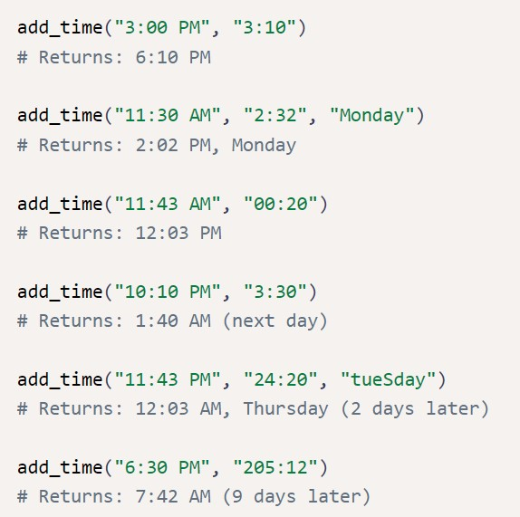
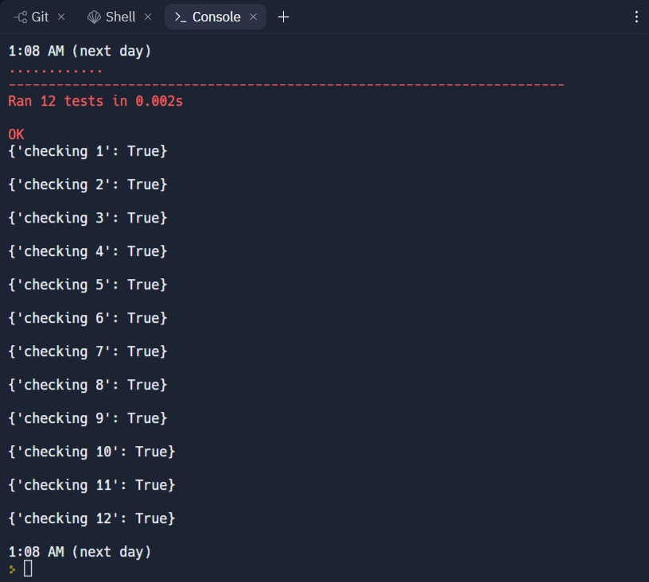

# Time Calculator
#### Documentation can be found on : [https://github.com/viktoriussuwandi/Time-Calculator](https://github.com/viktoriussuwandi/Time-Calculator)

This is the result for the complete Time Calculator project. 
Instructions for building this project can be found at 
https://www.freecodecamp.org/learn/scientific-computing-with-python/scientific-computing-with-python-projects/time-calculator

###  Some of additional features :
     * Using tupple to pass variable between functions
     * Using ternary operator to fix day and time calculation
     * Using pytest to create online progress test
     * self tester function to do pre test

### Test Scenario :
1. Write a function named `add_time` that takes in two required parameters and one optional parameter:
   - a start time in the `12-hour clock` format (ending in AM or PM)
   - a `duration` time that indicates the number of `hours` and `minutes` (optional) a starting day of the week, case insensitive

2. The `function` should add the `duration time` to the `start time` and return `the result`.
3. If `the result` will be the `next day`, it should show `(next day)` after `the time`.
4. If `the result` will be `more` than `one day` later, it should show `(n days later)` after the time, where "n" is the `number` of days later.
5. If `the function` is given the optional `starting day` of the week parameter, then the output should display `the day of the week` of `the result`.
6. `The day of the week` in the output should appear after `the time` and before `the number of days later`.
7. Below are some examples of different cases `the function` should handle.
8. Pay close attention to the `spacing` and `punctuation` of `the results`.
9. Do not import any `Python libraries`. Assume that `the start times` are `valid times`.
10. `The minutes` in the duration time will be a whole number less than **60**, but `the hour` can be any whole number.

### Development
Write your code in `time_calculator.py`. For development, you can use main.py to test your `time_calculator()` function. Click the "run" button and `main.py` will run.

### Testing
The unit tests for this project are in `test_module.py`. We imported the tests from `test_module.py` to main.py for your convenience. The tests will run automatically whenever you hit the "run" button.

#### Test Result 
